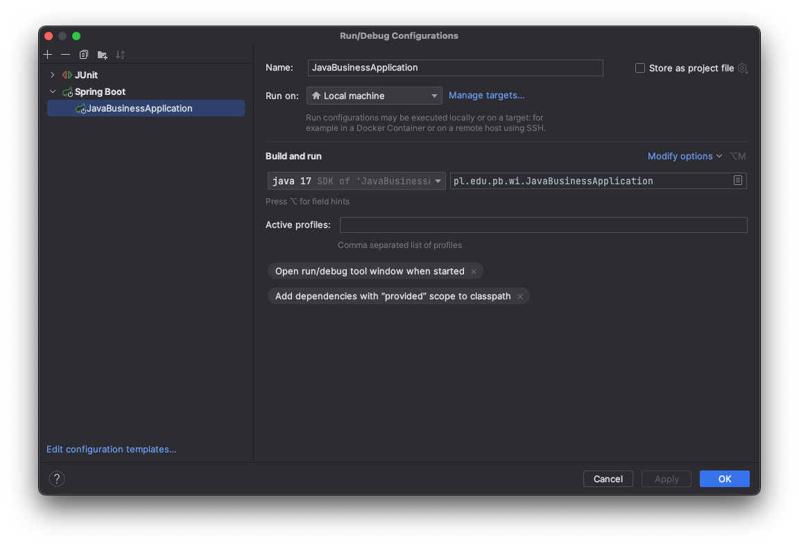

# Java Business Application - Sklep

## Autorzy
 - Filip Drażba
 - Szymon Nieścior
 - Jan Wasilewski

## Funkcjonalności
 - Przeglądanie/dodawanie/edycja/usuwanie produktów
 - Możliwość składania zamówienia na wybrane produkty (koszyk zakupów)
 - Możliwość przeglądania złożonych zamówień
 - Przesyłanie wiadomości o złożonym zamówieniu poprzez e-mail
 - Uwierzytelnianie

## Instalacja

### Uruchomienie i konfiguracja serwera:

Z poziomu katalogu głównego należy uruchomić polecenie:
``` docker compose up -d ```

Następnie można uruchomić aplikację korzystając na przykład z konfiguracji w środowisku IntelliJ IDEA


### Uruchomienie aplikacji klienta

Z katalogu głównego wykonać kolejno polecenia:
```npm install```
```ng serve```

Po instalacji aplikacja kliencka powinna działać pod adresem http://localhost:4200

## Wymagania
|          | Wersja  |
|----------|---------|
| Docker   | -       |
| Java SDK | 17      |
| NodeJS   | 18      |

